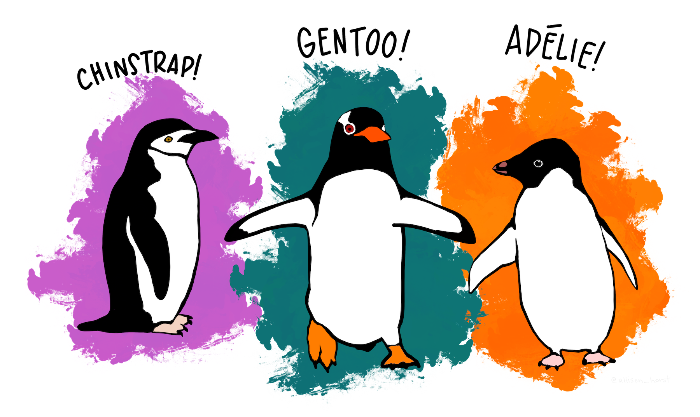
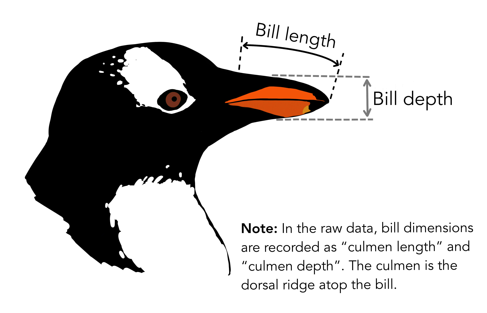

```{r setup, include = FALSE}
# getting params than change the behavior
full_report <- params$full
# do not show code by default
knitr::opts_chunk$set(
  echo = full_report # hide all code by default
)

# loading plots stored in an external script in this project
knitr::read_chunk('plots.R')
```

```{scss, echo = FALSE, eval = knitr::is_html_output()}
/* this scss code set into the Rmd file will be used to style code */
$color1: #0A7FB2; // blue

h1, h2, h3 {color: $color1;}

div {
  &.highlight-box {
   border-color: $color1;
    border-style: solid;
    padding: 0.5em;

    strong {color: $color1;}
  }
}
```

```{cat, engine.opts = list(file = 'preamble.tex'), eval = knitr::is_latex_output()}
\usepackage{tcolorbox}
\newtcolorbox{highlight-box}{
  colframe=blue,
  halign=center,
  boxsep=5pt,
  arc=4pt}
```

## About the data

**palmerpinguins** (https://allisonhorst.github.io/palmerpenguins) is an R package to provide a great dataset for data exploration & visualization, as an alternative to iris.

Let's look into it ! 

```{r packages, code = xfun::read_utf8('packages.R'), warning = FALSE, message = FALSE}
# packages are stored in an external file and read with code chunk option
```

The `penguins` data contains the following 

```{r}
glimpse(penguins)
```

## How many species ? 

We have `r length(unique(penguins$species))` species into this datasets: `r knitr::combine_words(unique(penguins$species))` that are not equally distributed

```{r}
penguins %>% 
  count(species)
```

```{r species-fig, out.width='60%', fig.align = 'center', echo = FALSE, fig.alt = "Illustration of pinguins species : Chinstrap, Gentoo and Adélia"}
# https://allisonhorst.github.io/palmerpenguins/reference/figures/lter_penguins.png

```

## Interesting Metrics

We can get some interesting mean metrics for each species:

```{r}
mean_metric <- penguins %>%
  group_by(species) %>%
  select(-year) %>%
  summarize(across(where(is.numeric), mean, na.rm = TRUE))
mean_metric
```

```{r, echo = FALSE, out.width='75%', fig.align = 'center', fig.alt="Illustration about penguins bill length and depth"}
# https://allisonhorst.github.io/palmerpenguins/reference/figures/culmen_depth.png

```

```{r, include = FALSE}
heaviest_specie <- mean_metric %>%
  filter(body_mass_g == max(body_mass_g)) %>% 
  pull(species)
```

::: {.highlight-box style="text-align: center;font-size: 1.5em;" latex=true}
The **`r heaviest_specie`** specie is heavier than other ! 
:::

## Is this equally distributed between Sex ? 

```{r gender-distribution, warning=FALSE, fig.alt = "Penguin flipper and body mass - Dimensions for male and female Adelie, Chinstrap and Gentoo Penguins at Palmer Station LTER"}
```

## And where do they live ? 

```{r species-fig, opts.label = TRUE, out.width='30%', fig.align='center'}
```

```{r, include = FALSE}
island_repart_alt <- "Horizontal bar chart, faceted by Species showing the number of penguins living on each island, Torgersen, Dream and Biscoe. Adelie lives on the three, whereas Gentoo on Biscoe and Chinstrap on Dream."
```

```{r island-repart, fig.alt= island_repart_alt, fig.align='center'}
```

::: {.highlight-box style="text-align: center;font-size: 1.5em;" latex=true}
One of the species lives on all islands and the others are specific to one island only. 
:::

<!-- this part is conditional to params for a full report with comments --> 

```{asis, echo = full_report}
----

# Appendix
```

```{r, child= if(full_report) 'acknowledgement.Rmd'}
```

```{r, eval = full_report, results = 'asis', echo = FALSE}
library(purrr)
links <- yaml::read_yaml("links.yaml")
md_links <- map_chr(links[[1]], ~ knitr::knit_expand(text = "* [About {{.x$text}}]({{.x$link}})"))
# knit_child is unnecessary because I don't have any R code in the text
content <- c(
  "## Link to resources about the recipes in this file",
  "",
  md_links
)
cat(content, sep = "\n")
```

