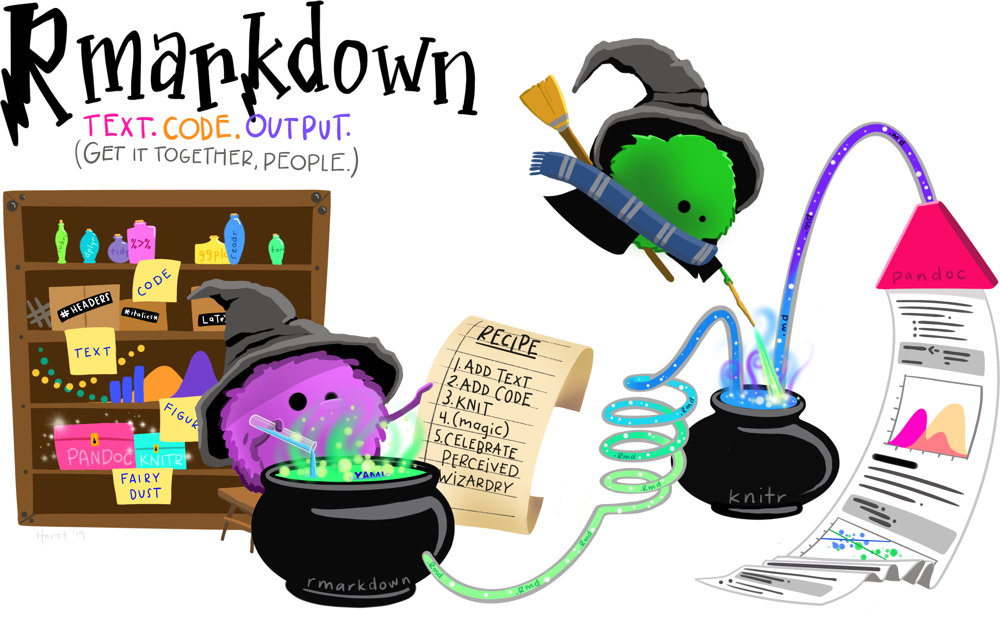

```{r xaringan-tachyons, echo=FALSE}
xaringanExtra::use_tachyons()
xaringanExtra::use_tile_view()
xaringanExtra::use_panelset()
library(texPreview)

# will be used several times in a cat engine
temp_file <- tempfile()
# setting option for the several cat engine
knitr::opts_template$set(cat_md = list(
  engine.opts = list(file = temp_file, lang = "markdown"),
  echo = TRUE
))
# clean tempfile after a chunk computation
knitr::knit_hooks$set(rm_temp = function(before) {
  if (!before) unlink(temp_file)
})

```

# Who am I ?

.subtitle[Short intro]

.center[

.profile[]

Christophe DERVIEUX &#8226; France

RStudio &#8226; Software Engineer &#8226; R Markdown Team

First Time Raukr Speaker

]
</br>
.pull-left[
.center[
.f2.color1[`r fontawesome::fa("github")`]</br>
[@cderv](https://github.com/cderv)
]
]

.pull-right[
.center[
.f2.color1[`r fontawesome::fa("twitter")`]</br>
[@chrisderv](https://twitter.com/chrisderv)
]
]

???

---
# What are we talking today ? 

.pull-left.center[

.f5[https://pkgs.rstudio.com/rmarkdown/]
]
.pull-right.center[

.f5[https://bookdown.org/yihui/rmarkdown-cookbook/]
]
???

Everyone should know rmarkdown among R users. Its principle has not changed since a long time 
(md + R = Rmd -> output format) quite easy to start (write text, add code chunk, compile) but it can be harder to learn new skill to be more efficient and get full power. 

That is where known recipes can help master more advanced skills. R Markdown Cookbook was thought as a non linear documentation

---
layout: true

# What happens when it renders ?

---

.center[]
.source-fig.center[Source: https://github.com/allisonhorst/stats-illustrations]

???

We often see these rmarkdown little wizard mixing Text & Code to produce document. Aim is to look deeper into this today. This is not so magic.

---

.center[]
.source-fig.center[
source: [R Markdown Cookbook](https://bookdown.org/yihui/rmarkdown-cookbook)
]

.box.f3[`knitr::knit()` + Pandoc (+ LaTeX for PDF) = `rmarkdown::render()`]

???

This is important to know so that one understand what to tweak to make something works

---
layout: false

# About the tools

.subtitle[We got you covered!]

* **rmarkdown** `r emo::ji("package")` will install **knitr** and **tinytex** for you
* _Pandoc_ is an external binary tool, .color1.underline[included] inside RStudio IDE. 
* _TinyTeX_ is the only thing to install if you want PDF output. (`tinytex::install_tinytex()`)

.pull-left[

In case you need it:
(.small[but you probably won't!])

* [Use another Pandoc version](https://bookdown.org/yihui/rmarkdown-cookbook/install-pandoc.html) (should never be necessary!)
* [Install missing LaTeX package](https://bookdown.org/yihui/rmarkdown-cookbook/install-latex-pkgs.html) (should not be necessary as **tinytex** will do it for you at render)
]


.pull-right[


.right[.small[source: [R Markdown Cookbook](https://bookdown.org/yihui/rmarkdown-cookbook)]]
]

---
# Let's dive now ! 

.center[]
.source-fig.center[Source: https://github.com/allisonhorst/stats-illustrations]

???

Not sure the aim is to be a rockstar but for sure it is to makes those three little guy playing together

---
# How to boost content creation ? 

.center[]

---

# Read external scripts into a chunk

.subtitle[About the `code` chunk option (1)]


.panelset[

.panel[.panel-name[in my_script.R]

```{cat, engine.opts = list(file = "my_script.R", lang = "r")}
add <- function(x, y) {
  x + y
}
````
]

.panel[.panel-name[in your Rmd]
````markdown
```{r, code=xfun::read_utf8('my_script.R')}`r ''`
```
````
]

.panel[.panel-name[equivalent to]

````markdown
```{r}`r ''`
`r xfun::file_string('my_script.R')`
```
````

]
]

```{r, include = FALSE}
unlink("my_script.R")
```


* This will fill the content of the chunk 

* Can be used with any engine

* Can be used with multiple script

???

https://bookdown.org/yihui/rmarkdown-cookbook/option-code.html

---

# Chunk content from variable

.subtitle[About the `code` chunk option (2)]

Ex: Installation instruction for packages. 

````markdown
```{r, include = FALSE}`r ''`
pkgs <- c("glue", "fs")
installation_package <- sprintf('install.packages("%s")', pkgs)
```
*```{r, eval = FALSE, code = installation_package}`r ''`
```
````
renders without evaluating to 
```{r, eval=FALSE, code = {pkgs <- c("glue", "fs");sprintf('install.packages("%s")', pkgs)}}
```

???

Form French slack question

---

# Read code chunks from a script

.subtitle[About `knitr::read_chunk()`]

.panelset[

.panel[.panel-name[my_script.R]

Use a special comment syntax to label code content.

```r
## ---- chunk-label
```
Ex in `my_chunks.R`

````r
## ---- my-chunk-a --------
1 + 1

## ---- my-chunk-b --------
plot(cars)
```` 
]

.panel[.panel-name[report.Rmd]

````markdown
Read an external script to load chunks:

```{r, include=FALSE, cache=FALSE}`r ''`
*knitr::read_chunk('test.R')
```

Now the code can be used chunk by chunk, e.g.,

```{r, my-chunk-a, echo=FALSE}`r ''`
```

```{r, my-chunk-b, fig.height=4}`r ''`
```
````

]
]

???

Useful for:

* sharing common part of code in a script
* Store all R code in one R file

https://bookdown.org/yihui/rmarkdown-cookbook/read-chunk.html

---

# Use Rmd child document

.subtitle[About `child` chunk option]

Load same content in several Rmd document

````markdown
```{r common-setup, include = FALSE, child = "_common.Rmd"}`r ''`
```
````

Conditionally include a content

````markdown
Change `BOSS_MODE` to `TRUE` if this report is to be read
by the boss:

```{r, include=FALSE}`r ''`
# variable impacting the rendering, which could be a parameter of a report
BOSS_MODE <- FALSE
```

Conditionally include the appendix:

*```{r, child=if (!BOSS_MODE) 'appendix.Rmd'}`r ''`
```
````

???

This respect chunk option so could be useful to conditionnal eval or not a part of a document

https://bookdown.org/yihui/rmarkdown-cookbook/child-document.html

---

# Dynamically create content

.subtitle[About `knitr::knit_child()`</br>(and `result = 'asis'`)]

.panelset[
.panel[
.panel-name[`template.Rmd`]

````markdown
## Regression on "`r knitr::inline_expr("x")`"

```{r}`r ''`
lm(mpg ~ ., data = mtcars[, c("mpg", x)])
```
````

* We want to apply one linear regression between `mpg` and each of other variables of `mtcars` 
```r
# select other variables than 'mpg'
x_vars <- setdiff(names(mtcars), 'mpg')
```
* We want the result to be included in .color2[its in own chapter].
]
.panel[.panel-name[`main.Rmd`]
````markdown
*```{r, echo=FALSE, results='asis'}`r ''`
# select other variables than 'mpg'
x_vars <- setdiff(names(mtcars), 'mpg')
# knit the template for each
res <- lapply(x_vars, function(x) {
*   knitr::knit_child('template.Rmd', 
    envir = environment(), quiet = TRUE
  )
})
# cat() the knitted output to be included 'asis' 
*cat(unlist(res), sep = '\n')
```
````

Can be combined with [`knitr::knit_expand()`](https://bookdown.org/yihui/rmarkdown-cookbook/knit-expand.html)

]
.panel[.panel-name[without external file]
````markdown
```{r, echo=FALSE, results='asis'}`r ''`
x_vars <- setdiff(names(mtcars), 'mpg')
res <- lapply(x_vars, function(x) {
*  knitr::knit_child(text = c(
    '## Regression on "`r knitr::inline_expr("x")`"',
    '',
    '```{r}',
    'lm(mpg ~ ., data = mtcars[, c("mpg", x)])',
    '```',
    ''
  ), envir = environment(), quiet = TRUE)
})
cat(unlist(res), sep = '\n')
```
````
]
]

???

https://bookdown.org/yihui/rmarkdown-cookbook/child-document.html

---

# Reuse a chunk

.subtitle[About chunk `label`]

````markdown
Here is a code chunk that is not evaluated:

*```{r, chunk-one, eval = FALSE}`r ''`
1 + 1
2 + 2
```

Now we actually evaluate it:

*```{r, chunk-one, eval = TRUE}`r ''`
```
````

First chunk will be used twice - different options are allowed.


???

https://bookdown.org/yihui/rmarkdown-cookbook/reuse-chunks.html

---

# Use labels to reference chunks

.subtitle[About chunk `ref.label`]

.panelset[

.panel[.panel-name[Rmd code]

````markdown

```{r chunk-b, echo = FALSE}`r ''`
# this is the chunk b
1 + 1
```

```{r chunk-c, echo = FALSE}`r ''`
# this is the chunk c
2 + 2
```
*```{r chunk-a, ref.label = c('chunk-c', 'chunk-b'), eval = FALSE}`r ''`
```

````
]

.panel[.panel-name[`chunk-a` equivalent to]

````markdown
```{r chunk-a, eval = FALSE}`r ''`
# this is the chunk c
2 + 2
# this is the chunk b
1 + 1
```
````

]

.panel[.panel-name[knitted md output]

````markdown
```
## [1] 2
```

```
## [1] 4
```

```r
# this is the chunk c
2 + 2
# this is the chunk b
1 + 1
```
````

]

]
???

https://bookdown.org/yihui/rmarkdown-cookbook/reuse-chunks.html

---

# How to boost output styling ? 

.center[]

---

# Use CSS from inside a Rmd file

.subtitle[About the `css` engine]

````markdown
```{css, echo = FALSE}`r ''`
/* add a blue border */
div.mybox {
  border-color: blue;
  border-style: solid;
  padding: 0.5em;
}

/* Set to blue bold text inside the box */
div.mybox strong {
  color: blue;
}
```
````

Applied directly in the Rmd document without an external css file 

Going further: See the [`js` engine](https://bookdown.org/yihui/rmarkdown-cookbook/details-tag.html) to apply JS code the same way

???

Useful for prototyping, for quick iteration, for single file example
echo = false is important if you don't want to show CSS source chunk in output

---
layout: true
# Use SASS the same way

.subtitle[About the `sass`/`scss` engine]

---

### What is SASS ?

Sass (https://sass-lang.com) is a CSS extension language that allows you to create CSS rules in much more flexible ways than you would do with plain CSS.
</br>
</br>
.center[]

It allows for variables, tweaking functions (called _mixins_), operations (like `/`), better CSS rule organisation (nesting, extensions, ...) and more.

---
.panelset[

.panel[.panel-name[previous css]

````markdown
```{css, echo = FALSE}`r ''`
div.mybox {
* border-color: blue;
  border-style: solid;
  padding: 0.5em;
}

div.mybox strong {
* color: blue;
}
```
````

]

.panel[.panel-name[scss]
````markdown
```{scss, echo = FALSE}`r ''`
*$color1: blue;

div {
  &.mybox {
*   border-color: $color1;
    border-style: solid;
    padding: 0.5em;

    strong {
*     color: $color1;
    }
  }
}
```
````

]
.panel[.panel-name[sass]
````markdown
```{sass, echo = FALSE}`r ''`
$color1: blue

div
  &.mybox
    border-color: $color1
    border-style: solid
    padding: 0.5em
  
    strong
      color: $color1
```
````
In both example, we are using special _SASS_ feature like [Nesting](https://sass-lang.com/documentation/style-rules/declarations#nesting) and [Parent Selector](https://sass-lang.com/documentation/style-rules/parent-selector).

]
]

---
layout: true
# Use SASS the same way

.subtitle[Powered by the new **sass** R `r emo::ji("package")`]

---

.center[


https://rstudio.github.io/sass/

]


---

.panelset[

.panel[.panel-name[style.sass]

```{cat, engine.opts = list(file = "style.sass", lang = "sass")}
$color1: blue

div
  &.mybox
    border-color: $color1
    border-style: solid
    padding: 0.5em
  
    strong
      color: $color1
```


]

.panel[.panel-name[rendered CSS]

```{r, class.output='css', comment=''}
# Rendering SASS file from R
sass::sass(sass::sass_file("style.sass"))
```

```{r, include=FALSE}
unlink("style.sass")
```


]

]

---

External `.sass` / `.scss` file can also be passed in the `css` argument of `html_document()`

</br>

````yaml
output:
  html_document:
    css: custom-style.scss
````

The file will be processed internally by `sass::sass_file()` and produce a `.css` automatically.

???

You can do much more with SASS. It pushes the limit of customization of a document.

How to use it ? Why this CSS example ?

---
layout: true

# Use custom blocks to style

.subtitle[Powered by Pandoc's fenced divs syntax]

---

```{cat, opts.label ='cat_md'}
::: mybox
Special **important** content
:::
```

```{css, echo = FALSE}
.mybox-demo {
  border-color: blue;
  border-style: solid;
  padding: 0.5em;
}

.mybox-demo strong {
  color: blue;
}
```

With the previous style applied, it will result in this box in the document
</br></br>
.mybox-demo[
Special **important** content
]
</br></br>
```{r demo-box, echo = FALSE, results='asis', rm_temp = TRUE}
o <- tempfile()
rmarkdown::pandoc_convert(temp_file, to = "html", output = I(o))
content <- xfun::read_utf8(o)
unlink(o)
```

```{cat, engine.opts = list(lang = "html"), code = content}
```

---

Attributes and id can be added too, e.g


```{cat, opts.label ='cat_md'}
::: {.mybox #box1 style="text-align: center;"}
Special **important** content
:::
```

The above add inline style to the div
</br></br>
.center.mybox-demo[
Special **important** content
]
</br></br>
```{r, include = FALSE, rm_temp = TRUE}
o <- tempfile()
rmarkdown::pandoc_convert(temp_file, to = "html", output = I(o))
content <- xfun::read_utf8(o)
unlink(o)
```

```{cat, engine.opts = list(lang = "html"), code = content}
```

---
layout: true 

# Aiming multi formats

.subtitle[About **rmarkdown** custom blocks for PDF support]

---

.panelset[

.panel[.panel-name[Support of latex]

```{cat, opts.label ='cat_md'}
::: {.mybox latex=true}
Special **important** content
:::
````

]
.panel[.panel-name[will output in LaTeX]
```{r, echo = FALSE}
o <- tempfile(fileext = ".tex")
rmarkdown::render(temp_file, rmarkdown::latex_fragment() , output_file = o, quiet = TRUE)
content <- xfun::read_utf8(o)
unlink(o)
```

```{cat, engine.opts = list(lang = "latex"), code = content}
```
]
]

Specially supported by R Markdown and not Pandoc.

.box[Create a LaTeX environment as easily as you can create a HTML div.]

---

This requires a LaTeX preamble for this custom environment to render to PDF, e.g using `tcolorbox` CTAN package.

```{cat, engine.opts = list(file = {tmp_tex <- tempfile(fileext = ".tex")}, lang = "latex")}
\usepackage{tcolorbox}
\newtcolorbox{mybox}{
  colframe=blue,
  halign=center,
  boxsep=5pt,
  arc=4pt}
```

To pass to the output format, e.g
```yaml
output: 
  pdf_document:
    includes:
      in_header: preamble.tex
```

---

Using the `cat` engine can help you write the preamble from within the Rmd file

````markdown
`r ''````{cat, engine.opts = list(file = 'preamble.tex')}
\usepackage{tcolorbox}
\newtcolorbox{mybox}{
  colframe=blue,
  halign=center,
  boxsep=5pt,
  arc=4pt}
```
````

This will result in the PDF as this box

```{r, include = FALSE}
if (!tinytex::check_installed("standalone")) tinytex::tlmgr_install("standalone")
```

```{texpreview, box-preview, code = c(xfun::read_utf8(tmp_tex), content), echo = FALSE}
```

---
layout: false
class: middle

.center[


LaTeX customization is a topic for another time ! `r emo::ji("roll_eyes")`

]

---
layout: false

# What we've learn so far ? 

.subtitle[Let's sum up!]

## Create content without repeating yourself 

* .color2[Import code chunk content] from a script or from a variable
* .color2[Use Rmd child document] to share content in several places
* .color2[Reuse some chunks] several times

## Customize output style

* .color2[Customize HTML output] using CSS and SASS code
* .color2[Create and style custom blocks] for HTML and PDF allowing better customization

---

# How to go further ?

.subtitle[and boost even more your skills !]

.pull-left.center[

## Look at examples

Xaringan Source + Demo file in </br> .f2.color1[`r fontawesome::fa("github")`] [cderv/raukr-2021-rmd-boost](https://github.com/cderv/raukr-2021-rmd-boost)
</br></br></br>
[`)](https://rstudio.cloud/project/2654845)

https://rstudio.cloud/project/2654845


]

.pull-right[

## More in the book

.center[


.source-fig[https://bookdown.org/yihui/rmarkdown-cookbook/]

]

]

---
class: center middle

# Thank you !

.f2.color1[`r fontawesome::fa("github")`]</br>https://github.com/cderv/raukr-2021-rmd-boost

---
class: annexe
count: false

# Acknowledgement

```{r, include = FALSE}
gh_handle_to_link <- function(handle) sprintf("[@%s](https://github.com/%s)", handle, handle)
```


* Emily Riederer and Yihui Xie for the R Markdown Cookbook

* Allison Horst for the illustrations.

* `r gh_handle_to_link("yonicd")` for the [**texPreview**](https://yonicd.github.io/texPreview/index.html) `r emo::ji("package")`

* `r gh_handle_to_link("cpsievert")` for the [**sass**](https://rstudio.github.io/sass/) `r emo::ji("package")`

* https://tenor.com for the GIF.
